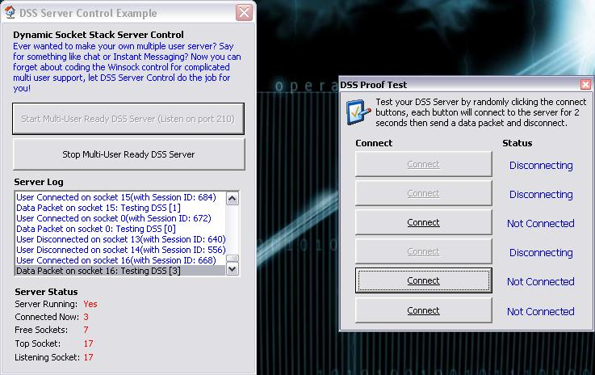



## \[ DSS Server Control 1\.1 \*Update\*\- Multi User Server Framework

### Description

Ever wanted to make your own multiple user server? Say for something like chat or Instant Messaging? Now you can forget about coding the Winsock control for complicated multi user support, let DSS Server Control do the job for you! You need a reasonably fast machine to see the control at its best. Please read the Readme.txt file included in the archive, or dont and get all frustrated; your choice ;p You will need WinRAR from www.rarsoft.com or www.winrar.com, as there is a RAR inside the ZIP file. If you need the source in ZIP format, then download www.angelfire.com/d20/vbfiles/dss_zip.zip. **UPDATED: The Socket Stack Managment in StartNewSocket() has been fixed** Read the Readme.txt file for more detailed information.
 
### More Info
 

             |
---                |---
**Submitted On**   |2002-10-21 12:54:50
**By**             |[ByteForce UK](https://github.com/Planet-Source-Code/PSCIndex/blob/master/ByAuthor/byteforce-uk.md)
**Level**          |Advanced
**User Rating**    |5.0 (20 globes from 4 users)
**Compatibility**  |VB 5\.0, VB 6\.0
**Category**       |[Custom Controls/ Forms/  Menus](https://github.com/Planet-Source-Code/PSCIndex/blob/master/ByCategory/custom-controls-forms-menus__1-4.md)
**World**          |[Visual Basic](https://github.com/Planet-Source-Code/PSCIndex/blob/master/ByWorld/visual-basic.md)
**Archive File**   |[DSS\_Server14847610212002\.zip](https://github.com/Planet-Source-Code/byteforce-uk-dss-server-control-1-1-update-multi-user-server-framework__1-40019/archive/master.zip)

